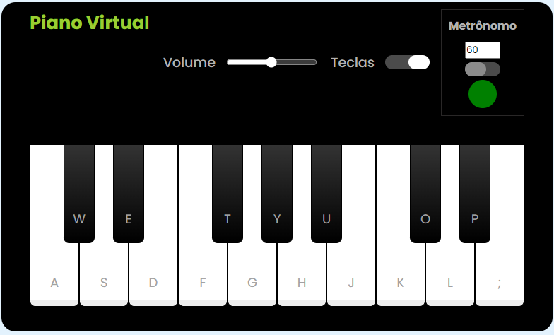

## 
# 👋Olá, é perigoso andar sozinho! 
## Embarque nesse guia para não ficar perdido.
### Desafios de código da DIO.me 

Eu sou o Alexandre, atualmente sou estudante de Tecnologia em Análise e Desenvolvimento de Sistemas.

Estou em processo de transição de carreira, e estou sempre disposto a aprender mais.

## 🥇Desafios de código do curso: Ri Happy - Front-end do Zero.
- Desafio: Construindo um Simulador de Piano com JavaScript e CSS.

* Nesse desafio foi construido um teclado padrão de 17 notas cromáticas, conforme padrão da música ocidental.

* Na parte superior do teclado temos:
    - Volume com opção de aumentar ou diminuir a intencidade do som.
    - Botão Teclas para visualizar as letras correspondente no teclado alfanumérico.
    - Metrônomo para determinar o andamento, tendo como velocidade mínima 40bpm e máxima 208bpm.

As teclas podem ser precionada com o mouse ou precionando a letra correspondente do teclado alfanumérico que aparece na tecla do piano.

##
###  Você pode me encontrar em:

&nbsp;
&nbsp;
&nbsp;
&nbsp;

##
